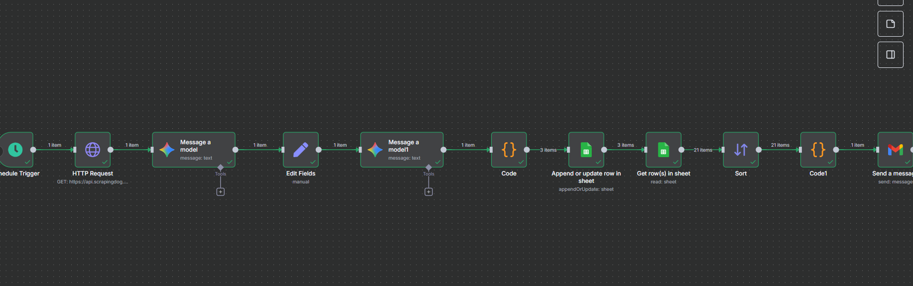

---

# 🚀 n8n Job Scraper, Matcher & Email Notifier

This project is an **end-to-end job scraping and resume matching automation** built with [n8n](https://n8n.io/) and self-hosted using **Docker**.  

It fetches job postings from the **ScrapingDog API**, processes them with **Google Gemini**, compares them with your resume, stores structured results into **Google Sheets**, and finally sends you a **daily email with the top job matches**.  

---

## 📌 Workflow Overview

 <!-- Add your updated screenshot here -->

### Steps in the Workflow:
1. **Schedule Trigger** → Runs daily at a set time.  
2. **HTTP Request** → Calls ScrapingDog `google_jobs` API to fetch job postings.  
3. **Message a Model (Gemini)** → Cleans and extracts structured job data.  
4. **Edit Fields** → Injects your resume text.  
5. **Message a Model 1 (Gemini)** → Adds `match_score` and generates a personalized `cover_letter`.  
6. **Code Node** → Parses AI response into valid JSON.  
7. **Append/Update Google Sheet** → Saves structured job data into Google Sheets.  
8. **Get Rows from Sheet** → Fetches stored job postings.  
9. **Sort Node** → Sorts jobs based on `match_score`.  
10. **Code Node (Formatter)** → Prepares top N jobs for email.  
11. **Send Email (Gmail/SMTP)** → Sends daily summary email with top matches.  

---

## ⚙️ Setup Instructions

### 1. Clone Repo
```bash
git clone https://github.com/your-username/n8n-job-matcher.git
cd n8n-job-matcher
````

### 2. Import Workflow

* In the n8n UI → Workflows → **Import from File**.
* Upload the JSON file (`job-matcher-workflow.json`).

### 3. Configure Credentials

Inside n8n, configure:

* **ScrapingDog API** → provide your API key.
* **Google Gemini API** → configure credentials.
* **Google Sheets OAuth2** → connect to your Google account.
* **Gmail/SMTP** → set up email sending.


---

## 🧠 Prompts Used for Gemini Models

You can update or tweak these prompts to improve results.

### 1. Job Data Cleaning Prompt

```
You are given raw job listings data in JSON format. Extract and transform it into a structured and simplified JSON array where each object contains only the following fields:

- job_title
- company_name
- location
- job_type (from extensions, e.g., Full-time/Part-time)
- posted_days_ago (from extensions if available)
- description_summary (shortened to max 200 words)
- key_responsibilities (list of bullet points if available)
- key_qualifications (list of bullet points if available)
- salary (if available, otherwise null)
- apply_links (list of apply option links)

Input JSON:
{{ $json }}

Return only the cleaned JSON output with no extra text.
```

### 2. Resume Matching & Cover Letter Prompt

```
You are a career assistant. 

Here is my resume:

{{ $json.resume_text }}

Here are job postings:

{{ $json.cleaned_jobs }}

For each job:
- Keep all important fields of the job such as: job_title, company_name, location, job_type, posted_days_ago, summary, responsibilities, qualifications, salary, apply_links.
- Add a new field `match_score` (rate relevance 1–5).
- Add a new field `cover_letter` (a short personalized cover letter tailored to this job, based on my resume).

Return only a valid JSON array with all jobs, including match_score and cover_letter. Do not include explanations, notes, markdown, or code block formatting.
```


---

## 📊 Output

The workflow generates:

* **Google Sheets log** → all job postings, match score, cover letter.
* **Daily email summary** → top N job matches (title, company, location, score, and link).

---


---

## 📜 License

MIT License

---

## 🙌 Author

**Rahul Kumar** – Data Analyst & Data Science Enthusiast

* [LinkedIn](https://www.linkedin.com/in/rahulkumar19k8/)
* [GitHub](https://github.com/rahulkumar-24)


